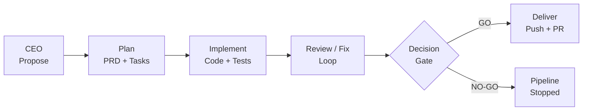
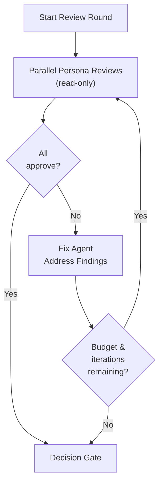

<p align="center">
  
</p>

<h1 align="center">ColonyOS</h1>

<p align="center">
  <strong>The fully autonomous AI pipeline that builds itself.</strong>
</p>

<p align="center">
  <a href="#quickstart">Quickstart</a> &middot;
  <a href="#how-it-works">How It Works</a> &middot;
  <a href="#the-pipeline">The Pipeline</a> &middot;
  <a href="#cli-reference">CLI Reference</a> &middot;
  <a href="#configuration">Configuration</a> &middot;
  <a href="#architecture">Architecture</a>
</p>

---

ColonyOS is an autonomous software engineering pipeline. A built-in CEO agent analyzes your codebase, decides what to build next, writes a PRD, implements the code, runs parallel expert reviews, fixes issues, and ships a pull request — all without human intervention.

It orchestrates Claude agent sessions via the [Claude Agent SDK](https://docs.anthropic.com/en/docs/agent-sdk) with full codebase awareness. Point it at any repo and let it work.

**ColonyOS builds itself.** The pipeline runs on its own codebase — every feature, fix, and review you see in this repo was proposed, implemented, and shipped by ColonyOS agents.

## Quickstart

```bash
pip install colonyos

cd your-project/
colonyos init              # interactive setup: project info + persona workshop
colonyos auto --loop 5     # let it build 5 features autonomously
```

Or direct it yourself:

```bash
colonyos run "Add Stripe billing integration"
```

## How It Works

ColonyOS has two operating modes:

**Autonomous mode** (`colonyos auto`) — the CEO agent analyzes your project, proposes the highest-impact feature, and the pipeline builds it end-to-end. Chain iterations with `--loop N` for continuous autonomous development.

**Directed mode** (`colonyos run "..."`) — you provide the feature prompt, and the pipeline handles everything from PRD generation through to a shipped PR.

Both modes run the same pipeline:



## The Pipeline

Each phase runs as an isolated Claude agent session with its own budget cap.

| # | Phase | What happens |
|---|-------|-------------|
| 0 | **CEO** | Analyzes the project, its history, and strategic direction. Proposes the single highest-impact feature to build next. *(autonomous mode only)* |
| 1 | **Plan** | Explores your codebase, generates a PRD with clarifying Q&A from your defined personas (running as parallel subagents), and produces a task breakdown. |
| 2 | **Implement** | Creates a feature branch, writes tests first, then implements each task. Commits as it goes. |
| 3 | **Review / Fix Loop** | Reviewer personas run independent, parallel, read-only reviews. If any request changes, a Staff+ fix agent addresses findings, then reviewers re-run. |
| 4 | **Decision Gate** | Reads all review artifacts and makes a **GO / NO-GO** verdict. NO-GO halts the pipeline. |
| 5 | **Deliver** | Pushes the branch and opens a pull request linking back to the PRD. |

### Review / Fix Loop Detail

The review phase is where ColonyOS ensures quality before shipping:



Each reviewer persona runs concurrently with its own expertise and perspective. When any reviewer requests changes, their findings are consolidated and handed to a dedicated fix agent. This loop repeats up to `max_fix_iterations` before the final decision gate.

## Prerequisites

- **Python 3.11+**
- **Claude Code CLI** — installed and authenticated (`claude --version` should work)
- **Git** — the target repo must be a git repository
- **GitHub CLI** (`gh`) — for the deliver phase to open PRs

## Setup: `colonyos init`

The init flow asks about your project and walks you through defining agent personas:

```
$ colonyos init

--- Project Info ---
Project name: MyApp
Brief description: B2B analytics platform
Tech stack: Python/FastAPI, React, PostgreSQL

--- Agent Personas ---
Define the expert personas who will review feature PRDs.

--- Persona 1 ---
Role: Senior Backend Engineer
Expertise: API design, database modeling, performance
Perspective: Thinks about scalability and data integrity
Participate in code reviews? [Y/n]: Y

--- Persona 2 ---
Role: Product Lead
Expertise: User research, prioritization
Perspective: Thinks about user value and shipping incrementally
Participate in code reviews? [Y/n]: n

Config saved to .colonyos/config.yaml
```

Personas shape how PRDs are written. During planning, each persona runs as a parallel subagent answering clarifying questions from their unique perspective. Personas with `reviewer: true` also participate in independent, parallel code reviews during the review/fix loop.

## CLI Reference

| Command | Description |
|---------|-------------|
| `colonyos init` | Interactive project + persona setup |
| `colonyos init --personas` | Re-run just the persona workshop |
| `colonyos auto` | Fully autonomous: CEO proposes, pipeline builds + ships |
| `colonyos auto --loop N` | Run N autonomous cycles back-to-back (max 10) |
| `colonyos auto --no-confirm` | Skip human approval even if `auto_approve` is off |
| `colonyos auto --propose-only` | CEO proposes but doesn't execute |
| `colonyos run "feature prompt"` | Directed mode: plan, implement, review, deliver |
| `colonyos run "..." --plan-only` | Stop after PRD + tasks |
| `colonyos run --from-prd cOS_prds/xxx.md` | Skip planning, implement an existing PRD |
| `colonyos run --resume <run-id>` | Resume a failed run from its last successful phase |
| `colonyos status` | Show recent runs with cost breakdown |

## Configuration

Config lives at `.colonyos/config.yaml` in your repo. Created by `colonyos init`.

```yaml
project:
  name: "MyApp"
  description: "B2B analytics platform"
  stack: "Python/FastAPI, React, PostgreSQL"

personas:
  - role: "Senior Backend Engineer"
    expertise: "API design, database modeling, performance"
    perspective: "Thinks about scalability and data integrity"
    reviewer: true        # participates in code reviews
  - role: "Product Lead"
    expertise: "User research, prioritization"
    perspective: "Thinks about user value and shipping incrementally"
    # reviewer defaults to false — plan-phase only

model: opus
auto_approve: true         # skip human confirmation in autonomous mode
budget:
  per_phase: 5.00         # USD per Claude Code session
  per_run: 15.00          # USD total cap for a full run
phases:
  plan: true
  implement: true
  review: true             # parallel per-persona reviews + fix loop
  deliver: true            # set false to skip PR creation
branch_prefix: "colonyos/"
prds_dir: "cOS_prds"
tasks_dir: "cOS_tasks"
reviews_dir: "cOS_reviews"
proposals_dir: "cOS_proposals"
max_fix_iterations: 2      # review/fix cycles before decision gate
```

## Output Structure

ColonyOS creates `cOS_`-prefixed directories in your repo that serve as a timestamped changelog of autonomous work:

```
your-repo/
  cOS_prds/
    20260316_172530_prd_stripe_billing.md
  cOS_tasks/
    20260316_172530_tasks_stripe_billing.md
  cOS_reviews/
    review_round1_backend_engineer.md
    review_round2_security_auditor.md
  cOS_proposals/
    20260317_155328_proposal_ceo_proposal.md
```

Run logs (costs, durations, session IDs) go to `.colonyos/runs/` which is gitignored by default.

## Architecture

```
src/colonyos/
  cli.py            # Click CLI entry point
  init.py           # Interactive persona workshop
  orchestrator.py   # Phase chaining: CEO → plan → implement → review → deliver
  agent.py          # Claude Agent SDK wrapper
  config.py         # .colonyos/config.yaml loader
  models.py         # Persona, PhaseResult, RunLog
  naming.py         # Deterministic timestamped filenames
  instructions/     # Markdown templates passed to Claude Code
    ceo.md          # Autonomous feature proposal
    plan.md         # PRD + task generation
    implement.md    # Test-first implementation
    review.md       # Per-persona review with structured verdict
    fix.md          # Staff+ engineer fix agent
    decision.md     # GO/NO-GO decision gate
    deliver.md      # PR creation
```

Instructions are markdown templates shipped with the package. They're passed as system prompts to Claude Code sessions. Override them by placing custom versions in `.colonyos/instructions/` in your repo.

## Development

```bash
git clone https://github.com/rangelak/ColonyOS.git
cd ColonyOS
python3 -m venv .venv
source .venv/bin/activate
pip install -e .
pip install pytest
pytest
```

## License

MIT
