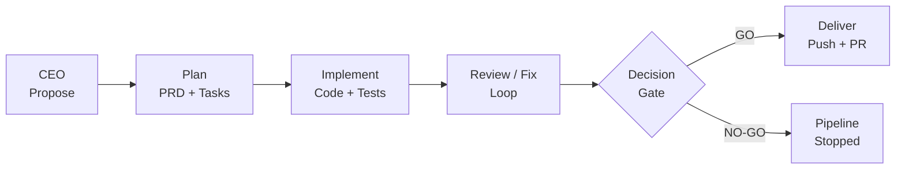
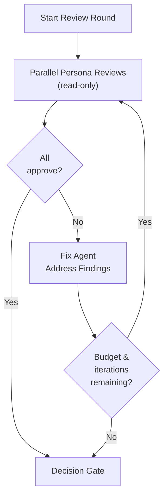

<p align="center">
  
</p>

<h1 align="center">ColonyOS</h1>

<p align="center">
  <strong>The fully autonomous AI pipeline that builds itself.</strong>
</p>

<p align="center">
  <a href="https://github.com/rangelak/ColonyOS/actions/workflows/ci.yml"></a>
  <a href="https://pypi.org/project/colonyos/"></a>
  <a href="https://github.com/rangelak/ColonyOS/blob/main/LICENSE"></a>
  <a href="https://www.python.org/downloads/"></a>
</p>

<p align="center">
  <a href="#zero-to-pr">Zero to PR</a> &middot;
  <a href="#quickstart">Quickstart</a> &middot;
  <a href="#how-it-works">How It Works</a> &middot;
  <a href="#the-pipeline">The Pipeline</a> &middot;
  <a href="#cli-reference">CLI Reference</a> &middot;
  <a href="#configuration">Configuration</a> &middot;
  <a href="#built-by-colonyos">Built by ColonyOS</a> &middot;
  <a href="#why-colonyos">Why ColonyOS?</a>
</p>

---

ColonyOS is an autonomous software engineering pipeline. A built-in CEO agent analyzes your codebase, decides what to build next, writes a PRD, implements the code, runs parallel expert reviews, fixes issues, and ships a pull request — all without human intervention.

It orchestrates Claude agent sessions via the [Claude Agent SDK](https://docs.anthropic.com/en/docs/agent-sdk) with full codebase awareness. Point it at any repo and let it work.

**ColonyOS builds itself.** The pipeline runs on its own codebase — every feature, fix, and review you see in this repo was proposed, implemented, and shipped by ColonyOS agents.

<!-- Terminal recording placeholder — will be added in a future release -->

## Zero to PR

Three commands. Under 2 minutes of human effort.

```bash
# 1. Install (30 seconds) — pick one:
pipx install colonyos                          # recommended
pip install colonyos                           # alternative
curl -sSL https://raw.githubusercontent.com/rangelak/ColonyOS/main/install.sh | sh  # one-liner
brew tap colonyos/tap && brew install colonyos # Homebrew (macOS/Linux)

# 2. Check prerequisites (10 seconds)
colonyos doctor                # validates Python, Claude Code, Git, GitHub CLI

# 3. Initialize & run (60 seconds)
cd your-project/
colonyos init --quick --name "MyApp" --description "My project" --stack "Python"
colonyos run "Add a health check endpoint"
```

That's it. ColonyOS generates a PRD, implements the code with tests, runs multi-persona code review, and opens a pull request.

## Quickstart

### Prerequisites

```bash
colonyos doctor   # checks everything for you
```

Or verify manually:

- **Python 3.11+** — `python3 --version`
- **Claude Code CLI** — installed and authenticated (`claude --version`)
- **Git** — `git --version`
- **GitHub CLI** — `gh auth status`

> **Recommended**: Install ColonyOS globally with `pipx install colonyos` so it's available in any project directory.
> Also available via `curl -sSL https://raw.githubusercontent.com/rangelak/ColonyOS/main/install.sh | sh`
> or `brew tap colonyos/tap && brew install colonyos`.

### Setup

```bash
pipx install colonyos          # or: pip install colonyos

cd your-project/
colonyos init                  # interactive setup: project info + persona workshop
```

For zero-prompt setup:

```bash
colonyos init --quick --name "MyApp" --description "B2B analytics" --stack "Python/FastAPI"
```

### Run

```bash
# Directed mode — you choose what to build
colonyos run "Add Stripe billing integration"

# Autonomous mode — the CEO agent decides
colonyos auto --loop 5

# Long-running autonomous mode — walk away for the day
colonyos auto --loop 50 --max-hours 24 --max-budget 500 --no-confirm
```

## How It Works

ColonyOS has two operating modes:

**Autonomous mode** (`colonyos auto`) — the CEO agent analyzes your project, proposes the highest-impact feature, and the pipeline builds it end-to-end. Chain iterations with `--loop N` for continuous autonomous development. Set `--max-hours` and `--max-budget` for safety caps.

**Directed mode** (`colonyos run "..."`) — you provide the feature prompt, and the pipeline handles everything from PRD generation through to a shipped PR.

Both modes run the same pipeline:



## The Pipeline

Each phase runs as an isolated Claude agent session with its own budget cap.

| # | Phase | What happens |
|---|-------|-------------|
| 0 | **CEO** | Analyzes the project, its history, and strategic direction. Proposes the single highest-impact feature to build next. *(autonomous mode only)* |
| 1 | **Plan** | Explores your codebase, generates a PRD with clarifying Q&A from your defined personas (running as parallel subagents), and produces a task breakdown. |
| 2 | **Implement** | Creates a feature branch, writes tests first, then implements each task. Commits as it goes. |
| 3 | **Review / Fix Loop** | Reviewer personas run independent, parallel, read-only reviews. If any request changes, a Staff+ fix agent addresses findings, then reviewers re-run. |
| 4 | **Decision Gate** | Reads all review artifacts and makes a **GO / NO-GO** verdict. NO-GO halts the pipeline. |
| 5 | **Deliver** | Pushes the branch and opens a pull request linking back to the PRD. |

### Review / Fix Loop Detail

The review phase is where ColonyOS ensures quality before shipping:



Each reviewer persona runs concurrently with its own expertise and perspective. When any reviewer requests changes, their findings are consolidated and handed to a dedicated fix agent. This loop repeats up to `max_fix_iterations` before the final decision gate.

## CLI Reference

| Command | Description |
|---------|-------------|
| `colonyos doctor` | Check prerequisites and environment health |
| `colonyos init` | Interactive project + persona setup |
| `colonyos init --quick` | Zero-prompt setup with defaults (first persona pack) |
| `colonyos init --personas` | Re-run just the persona workshop |
| `colonyos auto` | Fully autonomous: CEO proposes, pipeline builds + ships |
| `colonyos auto --loop N` | Run N autonomous cycles back-to-back |
| `colonyos auto --max-hours H` | Stop loop after H wall-clock hours |
| `colonyos auto --max-budget USD` | Stop loop after USD aggregate spend |
| `colonyos auto --resume-loop` | Resume the most recent interrupted loop |
| `colonyos auto --no-confirm` | Skip human approval even if `auto_approve` is off |
| `colonyos auto --propose-only` | CEO proposes but doesn't execute |
| `colonyos run "feature prompt"` | Directed mode: plan, implement, review, deliver |
| `colonyos run "..." --plan-only` | Stop after PRD + tasks |
| `colonyos run --from-prd cOS_prds/xxx.md` | Skip planning, implement an existing PRD |
| `colonyos run --resume <run-id>` | Resume a failed run from its last successful phase |
| `colonyos run --issue <number>` | Use a GitHub issue as the prompt source |
| `colonyos review <branch>` | Run standalone multi-persona code review on a branch |
| `colonyos review --base <branch>` | Base branch to compare against (default: main) |
| `colonyos review --no-fix` | Skip fix loop, review only |
| `colonyos review --decide` | Run decision gate after reviews |
| `colonyos stats` | Show aggregate analytics dashboard across all runs |
| `colonyos stats -n/--last N` | Limit analytics to the N most recent runs |
| `colonyos stats --phase <name>` | Drill into a specific phase |
| `colonyos show <run-id>` | Show detailed inspection of a single run |
| `colonyos show <run-id> --json` | Output run data as JSON |
| `colonyos show <run-id> --phase <name>` | Show detail for a specific phase in the run |
| `colonyos status` | Show recent runs, loop summaries, and cost breakdown |
| `colonyos ci-fix <pr>` | Fix CI failures on a pull request using AI |
| `colonyos ci-fix <pr> --wait` | Fix CI then wait for re-run to complete |
| `colonyos ci-fix <pr> --max-retries N` | Retry fix-push-wait cycle up to N times |
| `colonyos watch` | Watch Slack channels and trigger pipeline runs from messages |
| `colonyos watch --max-hours N` | Maximum wall-clock hours for the watcher |
| `colonyos watch --max-budget N` | Maximum aggregate USD spend |
| `colonyos watch --dry-run` | Log triggers without executing pipeline |

## Configuration

Config lives at `.colonyos/config.yaml` in your repo. Created by `colonyos init`.

```yaml
project:
  name: "MyApp"
  description: "B2B analytics platform"
  stack: "Python/FastAPI, React, PostgreSQL"

personas:
  - role: "Senior Backend Engineer"
    expertise: "API design, database modeling, performance"
    perspective: "Thinks about scalability and data integrity"
    reviewer: true        # participates in code reviews
  - role: "Product Lead"
    expertise: "User research, prioritization"
    perspective: "Thinks about user value and shipping incrementally"
    # reviewer defaults to false — plan-phase only

model: opus
auto_approve: true         # skip human confirmation in autonomous mode
budget:
  per_phase: 5.00         # USD per Claude Code session
  per_run: 15.00          # USD total cap for a full run
  max_duration_hours: 8.0 # wall-clock cap for autonomous loops
  max_total_usd: 500.0    # aggregate spend cap for autonomous loops
phases:
  plan: true
  implement: true
  review: true             # parallel per-persona reviews + fix loop
  deliver: true            # set false to skip PR creation
branch_prefix: "colonyos/"
prds_dir: "cOS_prds"
tasks_dir: "cOS_tasks"
reviews_dir: "cOS_reviews"
proposals_dir: "cOS_proposals"
max_fix_iterations: 2      # review/fix cycles before decision gate
```

## Output Structure

ColonyOS creates `cOS_`-prefixed directories in your repo that serve as a timestamped changelog of autonomous work:

```
your-repo/
  CHANGELOG.md                              # auto-updated feature log (CEO reads this)
  cOS_prds/
    20260316_172530_prd_stripe_billing.md
  cOS_tasks/
    20260316_172530_tasks_stripe_billing.md
  cOS_reviews/
    review_round1_backend_engineer.md
    review_round2_security_auditor.md
  cOS_proposals/
    20260317_155328_proposal_ceo_proposal.md
```

The `CHANGELOG.md` at the project root is the source of truth for what's been built. The CEO reads it before proposing new features to avoid duplication. The deliver phase auto-appends entries after each successful run.

Run logs (costs, durations, session IDs) and loop state files go to `.colonyos/runs/` which is gitignored by default.

## Built by ColonyOS

Every feature in this repo was proposed, planned, implemented, reviewed, and shipped by ColonyOS agents running on their own codebase. Here are some of the PRDs the pipeline wrote for itself:

| Feature | PRD |
|---------|-----|
| Persona packs & pack selection | `cOS_prds/20260317_083203_prd_we_should_be_able_to_offer_the_users_prebuilt_personas_when_they_initialize.md` |
| Parallel per-persona code review | `cOS_prds/20260317_090603_prd_persona_review_phase_and_cos_directory_prefix.md` |
| Review-driven fix loop | `cOS_prds/20260317_144239_prd_add_a_review_driven_fix_loop_to_the_orchestrator_pipeline_when_the_decision_gate.md` |
| Resume failed runs | `cOS_prds/20260317_155508_prd_add_a_resume_run_id_flag_to_colonyos_run_that_resumes_a_previously_failed_run_fr.md` |
| CEO autonomous proposals | `cOS_prds/20260317_133813_prd_autonomous_ceo_stage.md` |
| Developer onboarding & long-running loops | `cOS_prds/20260317_163656_prd_i_want_this_to_be_super_easy_to_set_up_if_you_re_a_dev_you_should_be_able_to_be.md` |

Check the `cOS_prds/` and `cOS_proposals/` directories for the full history.

## Why ColonyOS?

Most AI coding tools are co-pilots — they wait for you to steer. ColonyOS is an autopilot.

**The self-improvement thesis**: If an AI pipeline can build software, and the pipeline itself is software, then the pipeline can improve itself. Every run makes the next run better — better prompts, better review criteria, better architecture.

**Why this matters**:
- **Compounding returns**: Each shipped PR teaches the pipeline about your codebase, making future PRDs more grounded.
- **Quality through diversity**: Multiple expert personas review code from different angles simultaneously, catching issues that a single reviewer would miss.
- **24/7 development**: With long-running loops (`--max-hours 24`), ColonyOS works while you sleep. Wake up to pull requests.
- **Full auditability**: Every decision is documented — PRDs, task breakdowns, review artifacts, decision gate verdicts. Nothing is a black box.

## Security Model

ColonyOS runs Claude Code sessions with `bypassPermissions` enabled, meaning the agent has full read/write/execute access within your repository. This is by design — the agent needs to create branches, write code, run tests, and push to GitHub.

**What this means for you**:
- Only run ColonyOS on repositories where you trust the agent to modify files
- Use budget caps (`max_total_usd`, `per_run`) to limit blast radius
- Review generated PRs before merging, just as you would for any contributor
- Long-running loops with `auto_approve: true` amplify the scope of autonomous action — set conservative caps

## Architecture

```
src/colonyos/
  cli.py            # Click CLI entry point (doctor, init, run, auto, status)
  init.py           # Interactive persona workshop + --quick mode
  orchestrator.py   # Phase chaining: CEO -> plan -> implement -> review -> deliver
  agent.py          # Claude Agent SDK wrapper
  config.py         # .colonyos/config.yaml loader
  models.py         # Persona, PhaseResult, RunLog, LoopState
  naming.py         # Deterministic timestamped filenames
  persona_packs.py  # Prebuilt persona packs (startup, backend, fullstack, opensource)
  instructions/     # Markdown templates passed to Claude Code
    ceo.md          # Autonomous feature proposal
    plan.md         # PRD + task generation
    implement.md    # Test-first implementation
    review.md       # Per-persona review with structured verdict
    fix.md          # Staff+ engineer fix agent
    decision.md     # GO/NO-GO decision gate
    deliver.md      # PR creation
```

Instructions are markdown templates shipped with the package. They're passed as system prompts to Claude Code sessions. Override them by placing custom versions in `.colonyos/instructions/` in your repo.

## Development

```bash
git clone https://github.com/rangelak/ColonyOS.git
cd ColonyOS
python3 -m venv .venv
source .venv/bin/activate
pip install -e .
pip install pytest
pytest
```

## Releasing

ColonyOS uses tag-based automated releases. The version is derived from git tags
via [setuptools-scm](https://github.com/pypa/setuptools-scm) — there is no
hardcoded version string anywhere in the codebase.

```bash
# 1. Create and push a version tag
git tag v0.2.0
git push origin v0.2.0

# 2. The release workflow automatically:
#    - Runs the full test suite on Python 3.11 and 3.12
#    - Builds sdist and wheel
#    - Publishes to PyPI via Trusted Publisher (OIDC)
#    - Creates a GitHub Release with changelog notes and checksums
```

## License

MIT

<details>
<summary><strong>New to Claude Code?</strong></summary>

### Setting Up Claude Code from Scratch

ColonyOS requires the Claude Code CLI. Here's how to get started:

1. **Install Node.js** (if not already installed):
   ```bash
   # macOS
   brew install node

   # Linux
   curl -fsSL https://deb.nodesource.com/setup_20.x | sudo -E bash -
   sudo apt-get install -y nodejs
   ```

2. **Install Claude Code CLI**:
   ```bash
   npm install -g @anthropic-ai/claude-code
   ```

3. **Authenticate**:
   ```bash
   claude
   # Follow the authentication prompts to connect your Anthropic account
   ```

4. **Verify**:
   ```bash
   claude --version
   ```

5. **Install GitHub CLI** (for the deliver phase):
   ```bash
   # macOS
   brew install gh

   # Linux
   sudo apt install gh
   ```

6. **Authenticate GitHub CLI**:
   ```bash
   gh auth login
   ```

Once everything is set up, run `colonyos doctor` to verify all prerequisites are in place.

</details>
